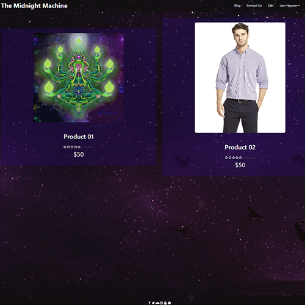
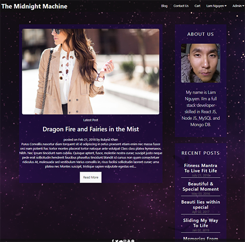

# Midnight-Machine: An Ecommerce and Blog Website created in React.

This is basically an Ecommerce website combined with a blog website written in React. It can be used for whatever and styled for whatever.

## Credit Goes To:

- Bassir Jafarzadeh and his course "Build Ecommerce Website Like Amazon [React & Node & MongoDB] which can be purchased [here](https://www.udemy.com/course/build-ecommerce-website-like-amazon-react-node-mongodb/)
- Rizwan Khan and his course "ReactJS Project From Scratch" which can be taken for free [here](https://www.youtube.com/channel/UCOEoWhllRuu7UVerYjbWqgA).

## Prerequisites and Deployment

- Installation of Web Browser to view webpage
- Visual Studio Code to analze the code for the website
- Node.js
- React JS
- Installation of Node Package Modules

## Built With

- Visual Studio Code
- Node.js
- React JS
- MongoDB Cloud

## Author

**Lam Nguyen**

## License

The Unlicense

## Deployed Application

View deployed application [here](https://midnight-machine-app.herokuapp.com/)

